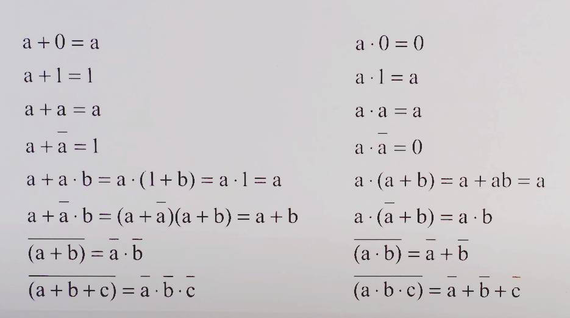

# 105-Cyfrowka

Pierwsze prawo De Morgana – zaprzeczenie alternatywy jest koniunkcja zaprzeczeń.\
~(p ∨ q) ⇔ ~p ∧ ~q

Drugie prawo De Morgana – zaprzeczenie koniunkcji jest alternatywa zaprzeczeń\
~(p ∧ q) ⇔ ~p ∨ ~q

Prawo podwójnej negacji:\
~(~p) ⇔ p

Prawo logiczne przemienność alternatywy:\
p ∨ q ⇔ q ∨ p

Prawo logiczne przemienność koniunkcji:\
p ∧ q ⇔ q ∧ p

Prawo logiczne łączności alternatywy:\
(p ∨ q) ∨ r ⇔ p ∨ (q ∨ r)

Prawo łączności koniunkcji:\
(p ∧ q) ∧ r ⇔ p ∧ (q ∧ r)

Prawo rozdzielności alternatywy względem koniunkcji:\
p ∨ (q ∧ r) ⇔ (p ∨ q) ∧ (p ∨ r)

Prawo rozdzielności koniunkcji względem alternatywy:\
p ∧ (q ∨ r) ⇔ (p ∧ q) ∨ (p ∧ r)

Prawo przechodniości implikacji:\
[(p ⇒ q) ∧ (q ⇒ r)] ⇒ (p ⇒ r)

Prawo wyłączonego środka:\
p ∨ ~p – prawo to mówi, że zawsze prawdziwe jest albo zdanie logiczne, albo jego zaprzeczenie.

Prawo zaprzeczenia implikacji:\
~(p ⇒ q) ⇔ p ∧ ~q

Prawo zastąpienia równoważności implikacją:\
(p ⇔ q) ⇔ [(p ⇒ q) ∧ (q ⇒ p)]

Prawo kontrapozycji:\
(p ⇒ q) ⇔ (~q ⇒ ~p)

Prawo odrywania:\
[(p ⇒ q) ∧ p] ⇒ q

Prawo eliminacji implikacji:\
(p ⇒ q) ⇔(~p) ∨ q

### Metoda Karnough

### Links
- https://botland.com.pl/blog/bramki-logiczne-jak-to-dziala/

### TUTS
- https://youtu.be/kK_6p4C8Fpo
- https://youtu.be/YNl9VEP-Fvg
- https://www.youtube.com/watch?v=SuKdbfN28y8
- https://www.youtube.com/watch?v=ACYixR0PXnE
